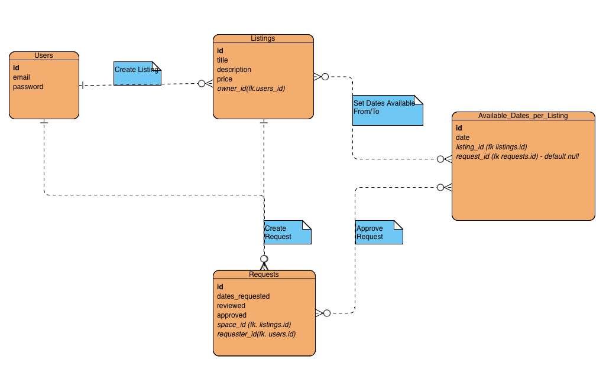
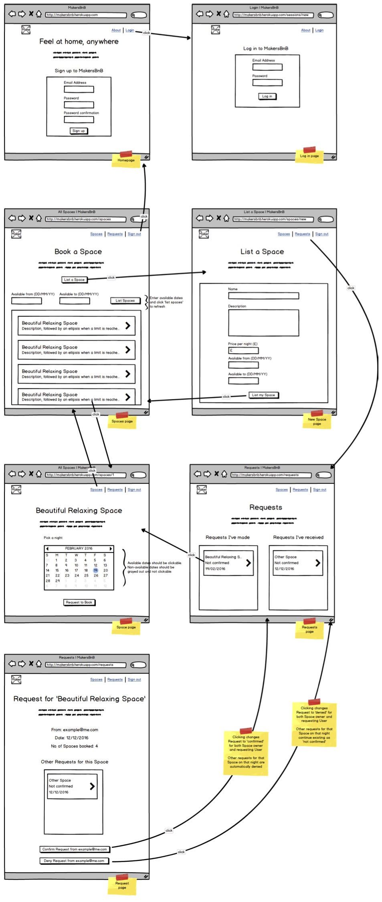

# MakersBnB Python Project

This is the first group project on Makers Academy's Software Engineering bootcamp.
This is a barebones crud app for Airbnb, created over one week through TTD, OOP, and Agile practices (pair programming, Kanban boards, etc.).

Project by Claire Peng, David O'Donnell, Daniel Kruszewski, and Onoura Wright.

The project aims are as follows:

* Learn to work and communicate effectively as part of a team to build a web application.
* Learn to break down projects into tasks and assign them to pairs.
* Learn to use agile ceremonies to organise your work and improve your processes.
* Learn to use the developer workflow to plan, implement and peer-review features.

Tech used:

* Python, Flask
* psycopg, PostgreSQL
* Playwright, Pytest
* Git, Github

## Project Specification:

We would like a web application that allows users to list spaces they have available, and to hire spaces for the night.

### Headline specifications (provided in project brief)

- Any signed-up user can list a new space.
- Users can list multiple spaces.
- Users should be able to name their space, provide a short description of the space, and a price per night.
- Users should be able to offer a range of dates where their space is available.
- Any signed-up user can request to hire any space for one night, and this should be approved by the user that owns that space.
- Nights for which a space has already been booked should not be available for users to book that space.
- Until a user has confirmed a booking request, that space can still be booked for that night.

## Planning:

ER Diagram for simple Makersbnb relational database:

UI Mockups (provided in project brief):

## Screenshot:

MVP Screenshot on Friday -- MVP achieved. As a group we chose to concentrated on the test-driving backend elements to satisfy the headline specs.
 TODO - personal extension project to recreate Airbnb UI to practice frontend.
